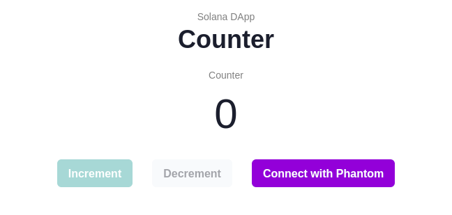

# Solana Example



Simple Solana program with frontend that let users increment counter, state is stored on-chain.

**Live example** is hosted on [GitHub Page](https://littleboycoding.github.io/solana-example/) (Devnet cluster)

## Development

```sh
# in program/
$ make
$ solana-test-validator
# In new terminal
$ solana program deploy -u localhost dist/program.so

# in client/
$ npm run dev
```

## Resources

- https://solanacookbook.com
- https://docs.solana.com
